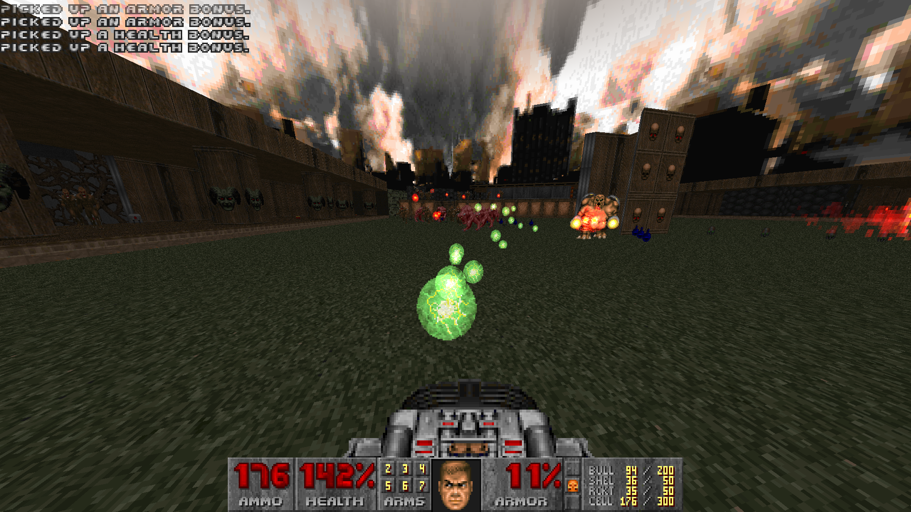

# Variable Weapons

Variable Weapons is a GZDoom-compatible gameplay mod for DOOM, DOOM II and its
variants and expansions and what have you.

If you ever thought "hmm, this Super Shotgun is really cool, but I wish it was
twice as powerful and made me fly in the opposite direction", then I don't know
how you got such a random thought. But Variable Weapons can fulfill your random
desires!

It's called "Variable Weapons" because they're not necessarily improved versions
of the original DOOM weapons, but they've been modified with new behaviours that
serve to make the player overpowered as frick.

Variable Weapons uses the power of the TEXTURES lump available in ZDoom-derived
ports to provide new graphics without necessarily creating new sprites.

## Installation

Grab a copy of [GZDoom](https://zdoom.org/downloads) and dust off your favourite
DOOM, be it 1, 2, TNT, Plutonia or even Freedoom. (Keep in mind that Variable
Weapons has a bit of visual incompatibility with Freedoom, but the gameplay
is still there.)

To download Variable Weapons, you can either:

1. Download it from [releases](https://github.com/That1M8Head/VariableWeapons/releases)
2. `git clone` this repository and zip it yourself, renaming `.zip` to `.pk3`
3. `git clone` this repository and use it directly, because you can do that
in GZDoom

## Port Compatibility

Variable Weapons is a GZDoom-compatible mod, which means you can play it with
any GZDoom-compatible port.

It won't work in any vanilla DOOM game or with a non-GZDoom port like PrBoom or
Crispy Doom.

## Manual

Variable Weapons' manual is available in AsciiDoc format, [at manual.adoc.](https://github.com/That1M8Head/VariableWeapons/blob/main/manual.adoc)

## Legal

Variable Weapons is licensed under the terms of the GNU General Public License,
version 3 or later.

DOOM is a trademark of id Software. This mod uses sounds/music from games such
as DOOM PS1 and DOOM Eternal.
